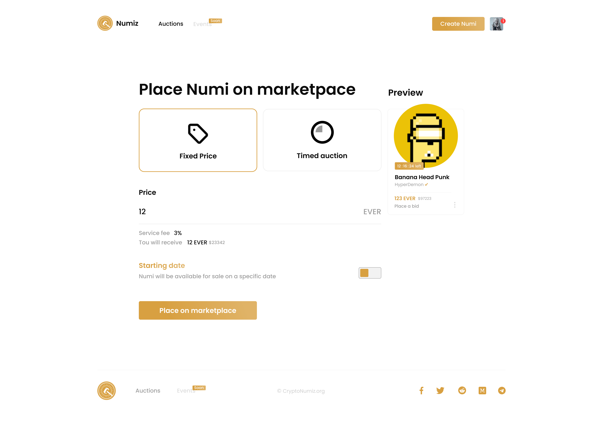
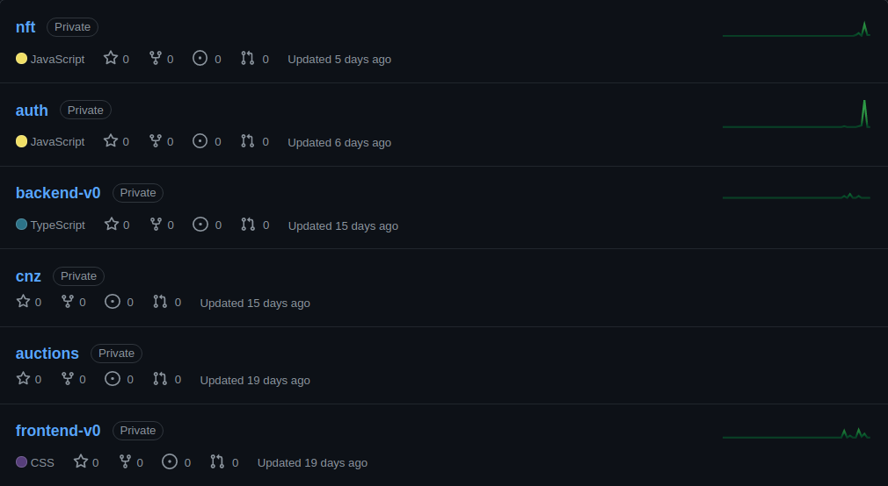

# FRONTEND

## Что мы делаем
Сайт numiz для торговли NFT с киллерфечей, которой нет ни у одного маркетплейса на блокчейне [Everscale](https://everscale.network), который является самым технологичный блокчейном на данный момент.

## Что нужно делать
- Контракты для вззаимодействием с токенами на [True-NFT](https://github.com/tonlabs/True-NFT), в частности контракты для торговли
- Доработка [True-NFT](https://github.com/tonlabs/True-NFT)
- Создание контрактов для токеномики, а именно контрактов для минтинга и управления [fungible токенами](https://github.com/tonlabs/flex/tree/main/tokens-fungible) проекта
- Деботы для всего вышеперечисленного

## Стек контрактов
- Solidity only

## Стек проекта

- Solidity контракты в блокчейне
- React на фронте
- Небольшие утилиты на бэке на Nodejs
- Репозитории на GitHub
- Сервера на DigitalOcean
- CI/CD на GitHub Actions

## Менеджмент
- Удалёнка без графика
- Общие созвоны раз в неделю в пятницу вечером
- Общение по задачам в Telegram

## Команда разработки
- Продуктовнер - общие вопросы, ревью кода и дизайна, найм 
- Разработчик контрактов - код на Solidity и JS
- Дизайнер - макеты, что в документе выше